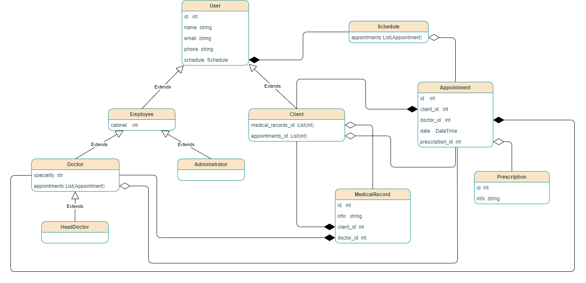

# .NET MAUI application Polyclinic

## Leonenko Aleksei, group 153502

## Functions of application

* **Appointments** - Client can easily get an appointment and it would be added to the schedule, where the doctor can see it.
* **Digital medical records** - Easy access to medical conclusions at any time.
* **Digital prescription** - No more paper prescriptions, everything in your phone!
* **Personal accounts**  for both employees and clients.
* **Info about polyclinic** - You can easily found info about doctors, specialities in the policlinic and how to get to the polyclinic.

## Data models:
1. `User model` - This model represents a user in the app. It contains such info as user ID, name, email and phone. Is parent for such data models as `Employee`, `Doctor`, `HeadDoctor`, `Administrator` and `Client`
2. `Employee` - This model represents an employee of polyclinics. Child model for `User model`. Contains information about the cabinet where the employee can be found.
3. `Doctor` - This model represents a Doctor. Child model for `Employee model`. Contains info about speciality and info about appointments.
4. `HeadDoctor` - This model represents a Head Doctor.
5. `Administrator` - This model represents an administrator of the polyclinic.
6. `Client` - This model represents a client. Contains medical records info and info about appointments
7. `MedicalRecord` - This model represents a medical conclusion after appointment. Contains an id, an info about a client, a doctor and the 
medical record itself.
8. `Appointment` - This model represents appointment info. It contains an id, a client info, a doctor info, info about date nad time of appointment and prescription.
9. `Prescriprion` - This model represents prescriprion. It contains an id and needed info.
